  

<h3 align="left"><samp>&gt; GITHUB_STATS</samp></h3>

  
  <!-- SWAP DOMAIN (self-host to stop rate-limit breakage): line above -->
  

  
  <!-- SWAP DOMAIN: line above -->

<h3 align="left"><samp>&gt; TECH_STACK</samp></h3>

  

<h3 align="left"><samp>&gt; CONNECT</samp></h3>

  
  
  
  

<h3 align="left"><samp>&gt; ./quote.sh</samp></h3>

  

<samp>&gt; Thanks for stopping by! ★</samp>

